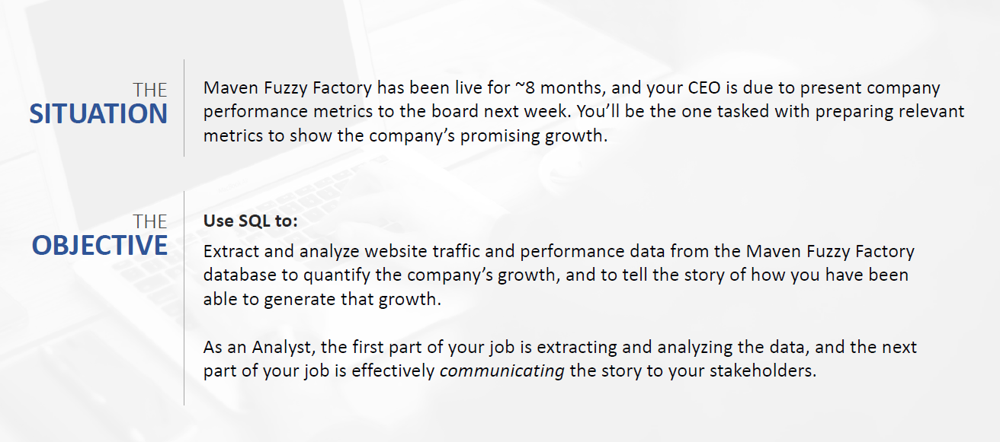
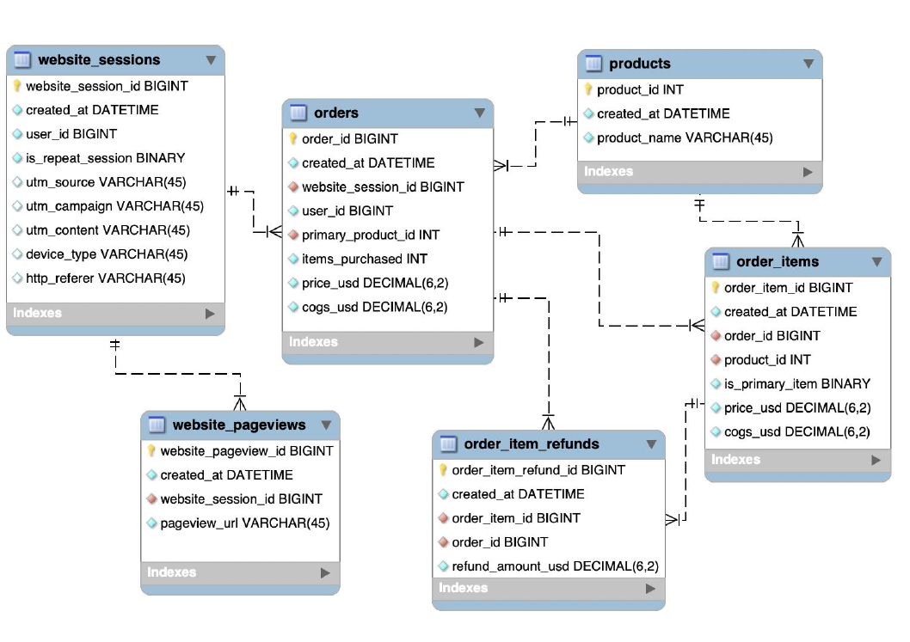

# Data for Board Meeting Presentation

## Introduction :
Maven Fuzzy Factory is fictitious and forward-thinking online retailer that has embarked on its e-commerce Journey. It is driven by a desire to bring novel and exciting products to the market, leveraging the power of e-commerce to reach a wide audience.

Refer below for the situation.



## Database Schema: 

We will be using the following tables for analysis.



### Table Creation:
The table is a very long one and hence unable to upload here.

### Scenarios and their respective codes:

#### 1. Gsearch seems to be the biggest driver of our business. Could you pull monthly trends for gsearch sessions and orders so that we can showcase the growth there? 

``` SQL
SELECT
YEAR(ws.created_at) AS Year,
MONTH(ws.created_at) AS Month,
COUNT(DISTINCT ws.website_session_id) AS sessions,
COUNT(DISTINCT o.order_id) AS orders
FROM
website_sessions AS ws
LEFT JOIN 
orders AS o
ON ws.website_session_id = o.website_session_id
WHERE ws.created_at < '2012-11-27'
AND ws.utm_source = 'gsearch'
GROUP BY Year, Month;
```

#### 2. Next, it would be great to see a similar monthly trend for Gsearch, but this time splitting out nonbrand and brand campaigns separately. I am wondering if brand is picking up at all. If so, this is a good story to tell. 

``` SQL
SELECT
YEAR(ws.created_at) AS yr,
MONTH(ws.created_at) AS mon,
COUNT(DISTINCT CASE WHEN utm_campaign = 'brand' THEN ws.website_session_id ELSE NULL END) AS brand_sessions,
COUNT(DISTINCT CASE WHEN utm_campaign = 'brand' THEN o.order_id ELSE NULL END) AS brand_orders,
COUNT(DISTINCT CASE WHEN utm_campaign = 'nonbrand' THEN ws.website_session_id ELSE NULL END) AS nonbrand_sessions,
COUNT(DISTINCT CASE WHEN utm_campaign = 'nonbrand' THEN o.order_id ELSE NULL END) AS nonbrand_orders
FROM
website_sessions AS ws
LEFT JOIN 
orders AS o
ON ws.website_session_id = o.website_session_id
WHERE ws.created_at < '2012-11-27'
AND ws.utm_source = 'gsearch'
GROUP BY yr, mon;
```

#### 3. While we’re on Gsearch, could you dive into nonbrand, and pull monthly sessions and orders split by device type? I want to flex our analytical muscles a little and show the board we really know our traffic sources. 

``` SQL
SELECT
	YEAR(ws.created_at) AS yr, 
    MONTH(ws.created_at) AS mon, 
    COUNT(DISTINCT CASE WHEN device_type = 'desktop' THEN ws.website_session_id ELSE NULL END) AS desktop_sessions, 
    COUNT(DISTINCT CASE WHEN device_type = 'desktop' THEN o.order_id ELSE NULL END) AS desktop_orders,
    COUNT(DISTINCT CASE WHEN device_type = 'mobile' THEN ws.website_session_id ELSE NULL END) AS mobile_sessions, 
    COUNT(DISTINCT CASE WHEN device_type = 'mobile' THEN o.order_id ELSE NULL END) AS mobile_orders
FROM website_sessions AS ws
	LEFT JOIN orders AS o
		ON ws.website_session_id = o.website_session_id
WHERE ws.created_at < '2012-11-27'
	AND ws.utm_source = 'gsearch'
    AND ws.utm_campaign = 'nonbrand'
GROUP BY yr,mon;
```

#### 4. I’m worried that one of our more pessimistic board members may be concerned about the large % of traffic from Gsearch. Can you pull monthly trends for Gsearch, alongside monthly trends for each of our other channels?

``` SQL
SELECT
	YEAR(ws.created_at) AS yr, 
    MONTH(ws.created_at) AS mon, 
    COUNT(DISTINCT CASE WHEN utm_source = 'gsearch' THEN ws.website_session_id ELSE NULL END) AS gsearch_sessions,
    COUNT(DISTINCT CASE WHEN utm_source = 'bsearch' THEN ws.website_session_id ELSE NULL END) AS bsearch_sessions,
    COUNT(DISTINCT CASE WHEN utm_source IS NULL AND http_referer IS NOT NULL THEN ws.website_session_id ELSE NULL END) AS organic_sessions,
    COUNT(DISTINCT CASE WHEN utm_source IS NULL AND http_referer IS NULL THEN ws.website_session_id ELSE NULL END) AS direct_type_in_sessions
FROM website_sessions AS ws
	LEFT JOIN orders AS o
		ON ws.website_session_id = o.website_session_id
WHERE ws.created_at < '2012-11-27'
GROUP BY yr,mon;
```

#### 5. I’d like to tell the story of our website performance improvements over the course of the first 8 months. Could you pull session to order conversion rates, by month? 

``` SQL
SELECT
	YEAR(ws.created_at) AS yr, 
    MONTH(ws.created_at) AS mon, 
    COUNT(DISTINCT ws.website_session_id) AS sessions, 
    COUNT(DISTINCT o.order_id) AS orders, 
    COUNT(DISTINCT o.order_id)/COUNT(DISTINCT ws.website_session_id) AS conversion_rate    
FROM website_sessions AS ws
	LEFT JOIN orders AS o
		ON ws.website_session_id = o.website_session_id
WHERE ws.created_at < '2012-11-27'
GROUP BY yr,mon
ORDER BY mon;
```

#### 6. For the gsearch lander test, please estimate the revenue that test earned us (Hint: Look at the increase in CVR from the test (Jun 19 – Jul 28), and use nonbrand sessions and revenue since then to calculate incremental value).

``` SQL
SELECT 
    COUNT(DISTINCT ws.website_session_id) AS sessions_post_test_start
FROM website_sessions AS ws
WHERE ws.created_at < '2012-11-27'
  AND ws.website_session_id > (
    SELECT MAX(ws_inner.website_session_id)
    FROM website_sessions AS ws_inner
    JOIN website_pageviews AS wp
      ON wp.website_session_id = ws_inner.website_session_id
    WHERE ws_inner.utm_source = 'gsearch'
      AND ws_inner.utm_campaign = 'nonbrand'
      AND wp.pageview_url = '/home'
      AND ws_inner.created_at < '2012-11-27'
  )
  AND ws.utm_source = 'gsearch'
  AND ws.utm_campaign = 'nonbrand';
```

#### 7. For the landing page test you analyzed previously, it would be great to show a full conversion funnel from each of the two pages to orders. You can use the same time period you analyzed last time (Jun 19 – Jul 28).

``` SQL
WITH session_page_flags AS (
    SELECT
        ws.website_session_id,
        MAX(CASE WHEN wp.pageview_url = '/home' THEN 1 ELSE 0 END) AS saw_homepage,
        MAX(CASE WHEN wp.pageview_url = '/lander-1' THEN 1 ELSE 0 END) AS saw_custom_lander,
        MAX(CASE WHEN wp.pageview_url = '/products' THEN 1 ELSE 0 END) AS product_made_it,
        MAX(CASE WHEN wp.pageview_url = '/the-original-mr-fuzzy' THEN 1 ELSE 0 END) AS mrfuzzy_made_it,
        MAX(CASE WHEN wp.pageview_url = '/cart' THEN 1 ELSE 0 END) AS cart_made_it,
        MAX(CASE WHEN wp.pageview_url = '/shipping' THEN 1 ELSE 0 END) AS shipping_made_it,
        MAX(CASE WHEN wp.pageview_url = '/billing' THEN 1 ELSE 0 END) AS billing_made_it,
        MAX(CASE WHEN wp.pageview_url = '/thank-you-for-your-order' THEN 1 ELSE 0 END) AS thankyou_made_it
    FROM website_sessions ws
    LEFT JOIN website_pageviews wp ON ws.website_session_id = wp.website_session_id
    WHERE ws.utm_source = 'gsearch' 
        AND ws.utm_campaign = 'nonbrand' 
        AND ws.created_at < '2012-07-28'
        AND ws.created_at > '2012-06-19'
    GROUP BY ws.website_session_id
)

SELECT
    CASE 
        WHEN saw_homepage = 1 THEN 'saw_homepage'
        WHEN saw_custom_lander = 1 THEN 'saw_custom_lander'
        ELSE 'uh oh... check logic' 
    END AS segment,
    COUNT(*) AS sessions,
    COUNT(CASE WHEN product_made_it = 1 THEN 1 END) AS to_products,
    COUNT(CASE WHEN mrfuzzy_made_it = 1 THEN 1 END) AS to_mrfuzzy,
    COUNT(CASE WHEN cart_made_it = 1 THEN 1 END) AS to_cart,
    COUNT(CASE WHEN shipping_made_it = 1 THEN 1 END) AS to_shipping,
    COUNT(CASE WHEN billing_made_it = 1 THEN 1 END) AS to_billing,
    COUNT(CASE WHEN thankyou_made_it = 1 THEN 1 END) AS to_thankyou,
    COUNT(CASE WHEN product_made_it = 1 THEN 1 END) / COUNT(DISTINCT website_session_id) AS lander_click_rt,
    COUNT(CASE WHEN mrfuzzy_made_it = 1 THEN 1 END) / NULLIF(COUNT(CASE WHEN product_made_it = 1 THEN 1 END), 0) AS products_click_rt,
    COUNT(CASE WHEN cart_made_it = 1 THEN 1 END) / NULLIF(COUNT(CASE WHEN mrfuzzy_made_it = 1 THEN 1 END), 0) AS mrfuzzy_click_rt,
    COUNT(CASE WHEN shipping_made_it = 1 THEN 1 END) / NULLIF(COUNT(CASE WHEN cart_made_it = 1 THEN 1 END), 0) AS cart_click_rt,
    COUNT(CASE WHEN billing_made_it = 1 THEN 1 END) / NULLIF(COUNT(CASE WHEN shipping_made_it = 1 THEN 1 END), 0) AS shipping_click_rt,
    COUNT(CASE WHEN thankyou_made_it = 1 THEN 1 END) / NULLIF(COUNT(CASE WHEN billing_made_it = 1 THEN 1 END), 0) AS billing_click_rt
FROM session_page_flags
GROUP BY segment;
```

#### 8. I’d love for you to quantify the impact of our billing test, as well. Please analyze the lift generated from the test (Sep 10 – Nov 10), in terms of revenue per billing page session, and then pull the number of billing page sessions for the past month to understand monthly impact.

``` SQL
WITH billing_data AS (
    SELECT 
        wp.website_session_id, 
        wp.pageview_url AS billing_version_seen,
        o.price_usd
    FROM website_pageviews wp
    LEFT JOIN orders o ON o.website_session_id = wp.website_session_id
    WHERE wp.pageview_url IN ('/billing','/billing-2')
      AND wp.created_at BETWEEN '2012-09-10' AND '2012-11-10'
), monthly_billing_sessions AS (
    SELECT 
        COUNT(DISTINCT website_session_id) AS billing_sessions_past_month
    FROM website_pageviews
    WHERE pageview_url IN ('/billing','/billing-2') 
      AND created_at BETWEEN '2012-10-27' AND '2012-11-27'
)

SELECT
    bd.billing_version_seen, 
    COUNT(DISTINCT bd.website_session_id) AS sessions, 
    SUM(bd.price_usd) / COUNT(DISTINCT bd.website_session_id) AS revenue_per_billing_page_seen,
    mbs.billing_sessions_past_month
FROM billing_data bd, monthly_billing_sessions mbs
GROUP BY bd.billing_version_seen, mbs.billing_sessions_past_month; 
```
