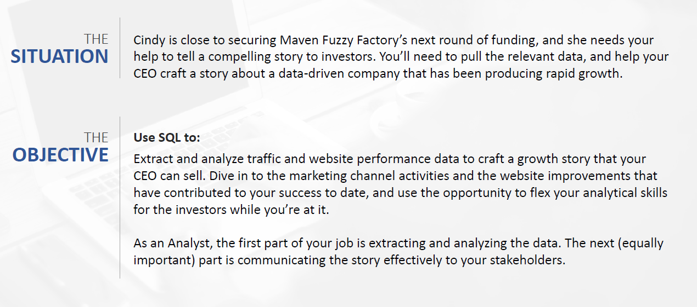

# Data for Investors Meet

## Introduction :
Maven Fuzzy Factory is a fictitious and forward-thinking online retailer that embarked on its e-commerce Journey 3 years back. It is driven by a desire to bring novel and exciting products to the market, leveraging the power of e-commerce to reach a wide audience. With an amazing growth, the company is all set to secure larger round of venture capital funding.

Refer to the situation below.



## Database Schema: 

We will be using the following tables for analysis.


### Table Creation:
The table is a very long one and hence unable to upload here.

### Scenarios and their respective codes:

#### 1. First, I’d like to show our volume growth. Can you pull overall session and order volume, trended by quarter for the life of the business? Since the most recent quarter is incomplete, you can decide how to handle it.

##### Insight & Output: 

###### The order volume has increased dramatically- about 100 times the order from the first quarter. Also the sessions volume has increased to a larger extent.
###### Click [here](SQL/FQ_1.csv) for the output.

``` SQL
SELECT
YEAR(ws.created_at) AS yr,
QUARTER(ws.created_at) AS qtr,
COUNT(DISTINCT ws.website_session_id) AS sessions,
COUNT(DISTINCT o.order_id) AS orders
FROM
website_sessions AS ws
LEFT JOIN 
orders AS o
ON ws.website_session_id = o.website_session_id
GROUP BY yr, qtr
ORDER BY yr, qtr;
-- The last quarter in the result is incomplete quarter as per the date of request.
```

#### 2. Next, let’s showcase all of our efficiency improvements. I would love to show quarterly figures since we launched, for session to order conversion rate, revenue per order, and revenue per session.

##### Insight & Output: 

###### With regards to the session-to-order conversion rate we have grown from 3.2% to 8.4% until the current quarter. The revenue per order has gone from a $49.99 (note that we were selling only one product initially) to $60+ now (we are selling multiple products, and introduced cross-selling and optimization on pages (business) done). The revenue per session has increased from a flat $1.59 to $5.3 in the current quarter. These metrics might help the Marketing manager in making efficient decisions on bidding etc.

###### Click [here](SQL/FQ_2.csv) for the output.

``` SQL
SELECT
YEAR(ws.created_at) AS yr,
QUARTER(ws.created_at) AS qtr,
-- COUNT(DISTINCT ws.website_session_id) AS sessions,
-- COUNT(DISTINCT o.order_id) AS orders,
COUNT(DISTINCT o.order_id) / COUNT(DISTINCT ws.website_session_id) AS conv_rate,
SUM(price_usd) / COUNT(DISTINCT o.order_id) AS revenue_per_order,
SUM(price_usd) / COUNT(DISTINCT ws.website_session_id) AS revenue_per_session
FROM
website_sessions AS ws
LEFT JOIN 
orders AS o
ON ws.website_session_id = o.website_session_id
GROUP BY yr, qtr
ORDER BY yr, qtr;
```

#### 3. I’d like to show how we’ve grown specific channels. Could you pull a quarterly view of orders from Gsearchnonbrand, Bsearch nonbrand, brand search overall, organic search, and direct type in?

##### Insight & Output: 

###### There has been an tremendous increase in orders across all channels. The brand search, organic and direct type-in are picking up compared to its performance back in 2012 Q2 where the gsearch to these brand ratio was around 6:1 and now it is less than 2:1 which is huge! This means the dependency on the paid marketing campaigns are decreasing! 
###### Click [here](SQL/FQ_3.csv) for the output.

``` SQL
SELECT
YEAR(ws.created_at) AS yr,
QUARTER(ws.created_at) AS qtr,
	COUNT(DISTINCT CASE WHEN utm_source = 'gsearch' AND utm_campaign = 'nonbrand' THEN o.order_id ELSE NULL END) AS gsearch_nonbrand_orders, 
    COUNT(DISTINCT CASE WHEN utm_source = 'bsearch' AND utm_campaign = 'nonbrand' THEN o.order_id ELSE NULL END) AS bsearch_nonbrand_orders, 
    COUNT(DISTINCT CASE WHEN utm_campaign = 'brand' THEN o.order_id ELSE NULL END) AS brand_search_orders,
    COUNT(DISTINCT CASE WHEN utm_source IS NULL AND http_referer IS NOT NULL THEN o.order_id ELSE NULL END) AS organic_search_orders,
    COUNT(DISTINCT CASE WHEN utm_source IS NULL AND http_referer IS NULL THEN o.order_id ELSE NULL END) AS direct_type_in_orders
FROM
website_sessions AS ws
LEFT JOIN
orders AS o
ON ws.website_session_id = o.website_session_id
GROUP BY yr,qtr
ORDER By yr,qtr;
```

#### 4. Next, let’s show the overall session to order conversion rate trends for those same channels, by quarter. Please also make a note of any periods where we made major improvements or optimizations.

##### Insight & Output: 

###### All of the channels have seen an increase in the conversion rates. The gsearch non brand has doubled since the start with 3.2% to almost 8% now.Likewise there has been steady increase across all the channels as well. And as said earlier, the steady increase across the organic, direct type-in and brand is a good story!! 
###### Click [here](SQL/FQ_4.csv) for the output.

``` SQL
SELECT
YEAR(ws.created_at) AS yr,
QUARTER(ws.created_at) AS qtr, 
COUNT(DISTINCT CASE WHEN utm_source = 'gsearch' AND utm_campaign = 'nonbrand' THEN o.order_id ELSE NULL END) /
COUNT(DISTINCT CASE WHEN utm_source = 'gsearch' AND utm_campaign = 'nonbrand' THEN ws.website_session_id ELSE NULL END) AS gsearch_nonbrand_conv_rate,
COUNT(DISTINCT CASE WHEN utm_source = 'bsearch' AND utm_campaign = 'nonbrand' THEN o.order_id ELSE NULL END) /
COUNT(DISTINCT CASE WHEN utm_source = 'bsearch' AND utm_campaign = 'nonbrand' THEN ws.website_session_id ELSE NULL END) AS bsearch_nonbrand_conv_rate,
COUNT(DISTINCT CASE WHEN utm_campaign = 'brand' THEN o.order_id ELSE NULL END) /
COUNT(DISTINCT CASE WHEN utm_campaign = 'brand' THEN ws.website_session_id ELSE NULL END) AS brand_search_conv_rate,
COUNT(DISTINCT CASE WHEN utm_source IS NULL AND http_referer IS NOT NULL THEN o.order_id ELSE NULL END) /
COUNT(DISTINCT CASE WHEN utm_source IS NULL AND http_referer IS NOT NULL THEN ws.website_session_id ELSE NULL END) AS organic_search_conv_rate,
COUNT(DISTINCT CASE WHEN utm_source IS NULL AND http_referer IS NULL THEN o.order_id ELSE NULL END) /
COUNT(DISTINCT CASE WHEN utm_source IS NULL AND http_referer IS NULL THEN ws.website_session_id ELSE NULL END) AS direct_type_conv_rate
FROM
website_sessions AS ws
LEFT JOIN
orders AS o
ON ws.website_session_id = o.website_session_id
GROUP BY yr,qtr
ORDER By yr,qtr;
```

#### 5. We’ve come a long way since the days of selling a single product. Let’s pull monthly trending for revenue and margin by product, along with total sales and revenue. Note anything you notice about seasonality.

##### Insight & Output: 

######  The mrfuzzy product was launched first in 2012 - The revenue trend observed here was, it spikes during the holiday season close to the end of each year - including Nov and Dec which also includes a lot of sales and offers might be. The lovebear is another product launched in the beginning of 2013 and the spike in the revenue trend is observed in the month of Feb, which is obviously transparent - on account of valentines day, targeting couple. The birthdaybear and minibear was introduced by the end of 2013 and beginning of 2014 respectively and the sales spikes during the holiday season, but not much data yet to predict the seasonality trend.

###### Click [here](SQL/FQ_5.csv) for the output.

``` SQL
SELECT
YEAR(created_at) as yr,
MONTH(created_at) as mon,
    SUM(CASE WHEN product_id = 1 THEN price_usd ELSE NULL END) AS mrfuzzy_revenue,
    SUM(CASE WHEN product_id = 1 THEN price_usd - cogs_usd ELSE NULL END) AS mrfuzzy_margin,
    SUM(CASE WHEN product_id = 2 THEN price_usd ELSE NULL END) AS lovebear_revenue,
    SUM(CASE WHEN product_id = 2 THEN price_usd - cogs_usd ELSE NULL END) AS lovebear_margin,
    SUM(CASE WHEN product_id = 3 THEN price_usd ELSE NULL END) AS birthdaybear_revenue,
    SUM(CASE WHEN product_id = 3 THEN price_usd - cogs_usd ELSE NULL END) AS birthdaybear_margin,
    SUM(CASE WHEN product_id = 4 THEN price_usd ELSE NULL END) AS minibear_revenue,
    SUM(CASE WHEN product_id = 4 THEN price_usd - cogs_usd ELSE NULL END) AS minibear_margin,
SUM(price_usd) AS total_revenue,
SUM(price_usd-cogs_usd) AS total_margin
FROM order_items
GROUP BY yr, mon
ORDER BY yr, mon;
```

#### 6. Let’s dive deeper into the impact of introducing new products. Please pull monthly sessions to the /products page, and show how the % of those sessions clicking through another page has changed over time, along with a view of how conversion from /products to placing an order has improved.

##### Insight & Output: 

###### The sessions making to product page, that is the click through rate has gone from 71% at the beginning of the business to 85% in the most recent month. Also the rate of landing on the product page and converting them into order has increased from 8% to 14% in the recent quarter.

###### Click [here](SQL/FQ_6.csv) for the output.

``` SQL
WITH product_pageviews AS (
SELECT
	website_session_id, 
    website_pageview_id, 
    created_at AS saw_product_page_at

FROM website_pageviews 
WHERE pageview_url = '/products'
) 
SELECT 
	YEAR(saw_product_page_at) AS yr, 
    MONTH(saw_product_page_at) AS mon,
    COUNT(DISTINCT pp.website_session_id) AS sessions_to_product_page, 
    COUNT(DISTINCT wp.website_session_id) AS clicked_to_next_page, 
    COUNT(DISTINCT wp.website_session_id)/COUNT(DISTINCT pp.website_session_id) AS clickthrough_rt,
    COUNT(DISTINCT o.order_id) AS orders,
    COUNT(DISTINCT o.order_id)/COUNT(DISTINCT pp.website_session_id) AS products_to_order_rt
FROM product_pageviews AS pp
	LEFT JOIN website_pageviews AS wp
		ON wp.website_session_id = pp.website_session_id -- same session
        AND wp.website_pageview_id > pp.website_pageview_id -- they had another page AFTER
	LEFT JOIN orders AS o
		ON o.website_session_id = pp.website_session_id
GROUP BY yr, mon;
```

#### 7. We made our 4th product available as a primary product on December 05, 2014 (it was previously only a cross-sell item). Could you please pull sales data since then, and show how well each product cross-sells from one another?

##### Insight & Output: 

###### The product 4 was cross sold with Product 1,2, and 3 since the cost of product 4 was less and it was like an add-on. Also the Product 3 cross sells with product 1 well with around 12% and product 4 cross sells with all the other products with around 20% of the orders. 
###### Click [here](SQL/FQ_7.csv) for the output.

``` SQL
CREATE TEMPORARY TABLE primary_product
SELECT 
	order_id, 
    primary_product_id, 
    created_at AS ordered_at
FROM orders 
WHERE created_at > '2014-12-05';

SELECT 
	primary_product_id, 
    COUNT(DISTINCT order_id) AS total_orders, 
    COUNT(DISTINCT CASE WHEN cross_sell_product_id = 1 THEN order_id ELSE NULL END) AS cross_sell_p1,
    COUNT(DISTINCT CASE WHEN cross_sell_product_id = 2 THEN order_id ELSE NULL END) AS cross_sell_p2,
    COUNT(DISTINCT CASE WHEN cross_sell_product_id = 3 THEN order_id ELSE NULL END) AS cross_sell_p3,
    COUNT(DISTINCT CASE WHEN cross_sell_product_id = 4 THEN order_id ELSE NULL END) AS cross_sell_p4,
    COUNT(DISTINCT CASE WHEN cross_sell_product_id = 1 THEN order_id ELSE NULL END)/COUNT(DISTINCT order_id) AS cross_sell_p1_rate,
    COUNT(DISTINCT CASE WHEN cross_sell_product_id = 2 THEN order_id ELSE NULL END)/COUNT(DISTINCT order_id) AS cross_sell_p2_rate,
    COUNT(DISTINCT CASE WHEN cross_sell_product_id = 3 THEN order_id ELSE NULL END)/COUNT(DISTINCT order_id) AS cross_sell_p3_rate,
    COUNT(DISTINCT CASE WHEN cross_sell_product_id = 4 THEN order_id ELSE NULL END)/COUNT(DISTINCT order_id) AS cross_sell_p4_rate
FROM
(
SELECT
	primary_product.*, 
    order_items.product_id AS cross_sell_product_id
FROM primary_product
	LEFT JOIN order_items 
		ON order_items.order_id = primary_product.order_id
        AND order_items.is_primary_item = 0 -- only bringing in cross-sells
) AS primary_w_cross_sell
GROUP BY primary_product_id;
```
